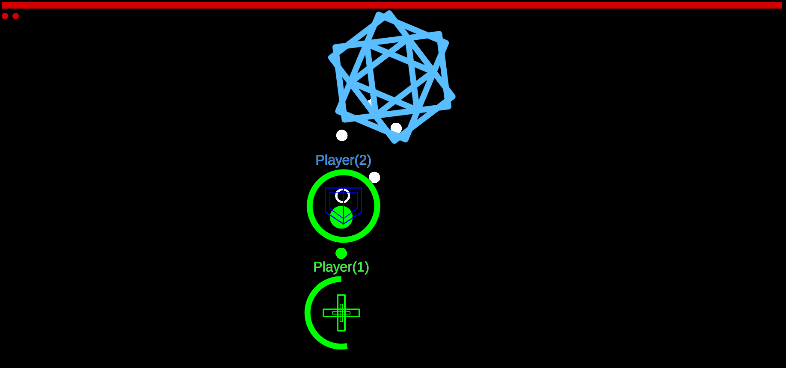

# 作品紹介

## RolePlayingShooting
private repositoryで製作中

- テーマ
  - ロールの概念のある協力型オンラインSTG
- コンセプト
  - 各々が固有の役割をこなすことによる，協力者との一体感を味わう

**目的**
- 疎遠になった友達と一緒に遊ぶ（そのためのオンライン）
- 自分で作ったゲームなら食いついてくれるはず，と思って自作する

### 現状でのプレイ画面
<!-- 

 -->

 

### 開発環境など
Unity 2021.3.2f1

## 死の国のエルヴィア
- テーマ
  - discord botによって動作するテキストRPG
- コンセプト
  - 装備を厳選して敵を倒す
  - （目的が先行していたのでコンセプトはおまけ）

**目的**
- 普段会話手段として使っているdiscordをゲームに変える
- 離れたところにいる相手にも手軽に遊んでもらえるゲームを作る

### 開発環境など
Python3

## processingで作ったミニゲーム

### Shooting

### Typing

<!--
**iChi412/iChi412** is a ✨ _special_ ✨ repository because its `README.md` (this file) appears on your GitHub profile.

Here are some ideas to get you started:

- 🔭 I’m currently working on ...
- 🌱 I’m currently learning ...
- 👯 I’m looking to collaborate on ...
- 🤔 I’m looking for help with ...
- 💬 Ask me about ...
- 📫 How to reach me: ...
- 😄 Pronouns: ...
- ⚡ Fun fact: ...
-->
